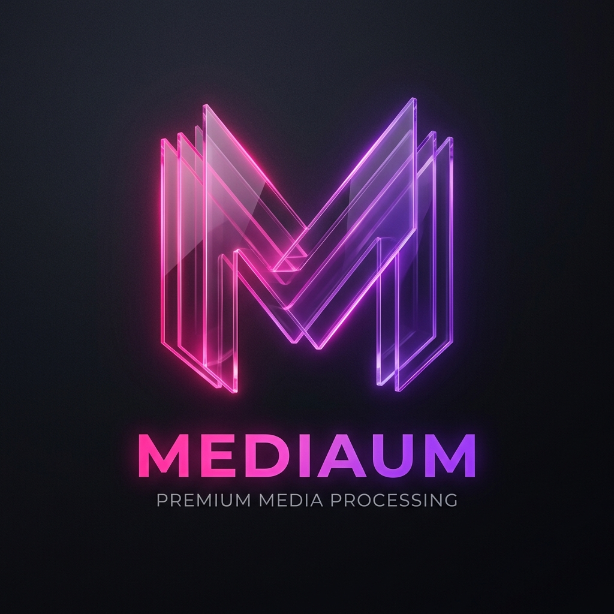

# Mediaum 🚀

> **Note**: This entire project was **AI-coded by Antigravity**, a coding assistant and I thought to make it available for everyone for free.

**Mediaum** is a premium, privacy-first web application for merging PDFs and converting images/PDFs. Built with a focus on local processing, your files never leave your computer.



## ✨ Features

- **Merge PDF**: Combine multiple PDF documents into a single, high-quality file.
- **Images to PDF**: Convert your photos and scans into professional PDF documents.
- **PDF to PPT**: Transform PDF pages into editable PowerPoint slides.
- **Smart Excel Converter**: Automatically parses unstructured ChatGPT snippets (`|`, `,`, or tab-separated) and converts them into professional `.xlsx` files with a live preview.
- **Collaborative Direct Share**: Real-time, peer-to-peer workspace for sharing files and text between devices (Mobile to Desktop and vice versa) without logins, email, or WhatsApp.
- **Local-First Processing**: All heavy lifting is done in your browser using `pdf-lib` and `pdf.js`. Data never leaves your device unless you choose to share it.
- **Premium UI**: Glassmorphism design system with smooth animations via `Framer Motion`.

## 🛠️ Technology Stack

- **Frontend**: React + Vite
- **Styling**: Vanilla CSS (Premium Glassmorphism System)
- **PDF Logic**: [pdf-lib](https://pdf-lib.js.org/)
- **PDF Rendering**: [pdf.js](https://mozilla.github.io/pdf.js/)
- **Excel Logic**: [SheetJS (xlsx)](https://sheetjs.com/)
- **PPT Generation**: [PptxGenJS](https://gitbrent.github.io/PptxGenJS/)
- **Icons**: [Lucide React](https://lucide.dev/)
- **Animations**: [Framer Motion](https://www.framer.com/motion/)

## 🚀 Getting Started

### Prerequisites
- Node.js (v18 or higher)
- npm or yarn

### Installation
1. Clone the repository
2. Install dependencies:
   ```bash
   npm install
   ```
3. Start the development server:
   ```bash
   npm run dev
   ```

## 📡 Collaborative Direct Share
Mediaum features a unique, login-free way to sync your devices:
1. Open **Direct Share** on your desktop.
2. Scan the **QR Code** with your mobile or share the **Session Link**.
3. Instantly share files, links, and notes in a **Unified Feed**.
4. Data is transferred via **WebRTC (PeerJS)** directly between browsers, ensuring maximum privacy and speed.

## 🔒 Privacy & Security

Mediaum is designed with privacy as a core value. 
- **Zero Uploads**: Files are processed using the browser's File API and Web Workers.
- **No Analytics**: No tracking, no cookies, no data collection.
- **Open Source**: Verify the processing logic in `src/utils/`.

## 🌍 Production Launch Guide

Mediaum is designed to be hosted as a **Static Web App**. Because it is local-first, it requires no backend (other than the PeerJS signaling server, which is handled by default via PeerJS Cloud).

### Deployment Steps
1. **Build the Project**:
   ```bash
   npm run build
   ```
2. **Deploy to Hosting**:
   - **Vercel**: Run `vercel` or connect your GitHub repo.
   - **Netlify**: Drag the `dist` folder to Netlify Drop.
   - **GitHub Pages**: Use the `gh-pages` package or GitHub Actions.
3. **PWA Activation**: The app is pre-configured with a `manifest.json`. Once hosted on HTTPS, users will be prompted to "Install" Mediaum for offline use.

### Monitoring & Health
Mediaum includes a built-in **System Monitor**. Click the **Activity** icon in the header to view:
- PeerJS Connection Status
- Active Connection Count
- Browser Heap Memory Usage
- Real-time Execution Logs

## 🔮 Future Roadmap (Solving Media Challenges)

Based on community research (Reddit/Developer Forums) and modern workflow demands, we are prioritizing:

1. **Large File Streaming**: Currently, the browser may crash with files >500MB. We plan to implement `Web Streams` and `IndexedDB` for chunked processing of massive videos and PDFs.
2. **NAT Traversal Optimization**: While PeerJS handles most connections, some corporate networks block WebRTC. We are planning to integrate custom **TURN servers** for 100% connectivity reliability.
3. **Advanced OCR**: Integrating `Tesseract.js` for on-device text recognition and light LLM integration for local document summarization.
4. **End-to-End Encrypted Vault**: A "Privacy Box" feature where you can store sensitive documents locally using AES-256 encryption.
5. **Format Expansion**: Adding support for HEIC to JPEG, WebP optimization, and SVG to PNG conversion.
6. **CLI Utility (`mediaum-cli`)**: A terminal-based version of Mediaum for developers to perform P2P transfers and PDF conversions directly from their terminal (similar to `croc` or `Magic Wormhole`).
7. **Smart Schema Converters**: Expanding our "Smart" engine to support one-click conversions between JSON, SQL Schema, Markdown Tables, and CSV.

## 📄 License

MIT License - feel free to use and modify for your own projects!
